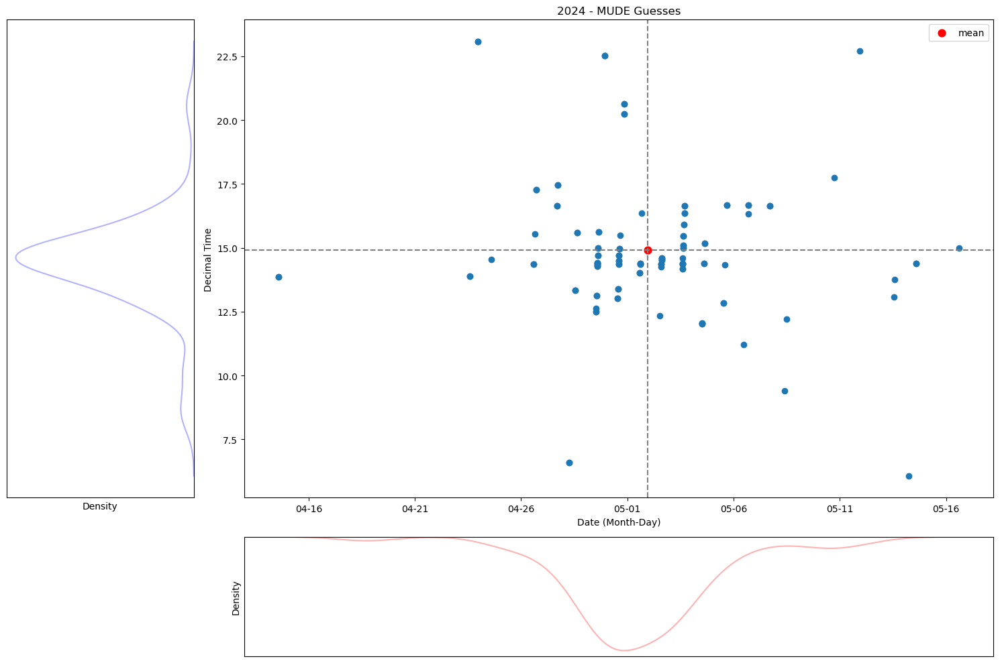

(intro)=

# Welcome to the iceclassic book, a MUDE Sidequest.

## Nenana Ice Classic
Describe here basics/history of Nenana Ice Classic. 

##  Motivation

- Make plot with guesses from MUDE-groups (also explained what was done in MUDE)
- What happened?


https://youtube.com/playlist?list=PLo0kgRXad08K-7DV00t4WNzKaaHovr2wi&si=GGUcnP9GR6W75b60 
```{eval-rst} 

.. raw:: html

    <iframe width="560" height="315" src="https://youtu.be/JE0zPEx8vxg?list=PLo0kgRXad08K-7DV00t4WNzKaaHovr2wi&t=206" title="YouTube video player" frameborder="0" allow="accelerometer; autoplay; clipboard-write; encrypted-media; gyroscope; picture-in-picture" allowfullscreen></iframe>
```
> sort out possible copyright for this(contact Nenana ice classic or borealisbroadband.net)
#### Historical results

but here same plot bu of historical guesses
  

### 2024 MUDE Guesses



> As we can see from the video, we weren't that off with respect to date, but a lot in time 


## Wisdom of the crowds?
> Assuming that our after finishing MUDE all the student are expert, so the distribution of guesses represent the actual distribution

Given the distribution what were the probabilities of the actual break up? 
Lets assume we are millionaires, we have narrow down the possible range to XX days and ZZ hour interval, what would be a good betting strategy? (the price pool is shared with all winners)

## Scope
Describe here the scope/objective of the book
## Authors
Gabriel Follet

## Acknowledges
This book ...

- Starting from MUDE project
- Continued into Q3 and Q4
- Special acknowledge to Prof. Robert Lanzafame
- and everyone else that participated in the first edition 


<!-- This book is licensed under a <a rel="license" href="http://creativecommons.org/licenses/by/4.0/">Creative Commons Attribution 4.0 International License</a>.

<a rel="license" href="http://creativecommons.org/licenses/by/4.0/"></a> -->
