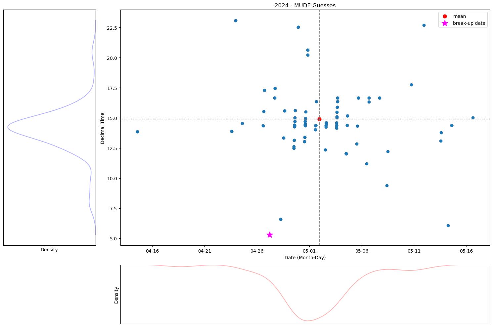

(intro)=

# Welcome to the iceclassic book, a MUDE Sidequest.

## Nenana Ice Classic
Describe here basics/history of Nenana Ice Classic. 

##  Motivation

- Make plot with guesses from MUDE-groups (also explained what was done in MUDE)
- [What happened?](https://youtu.be/hNCz1C4fkqo?list=PLo0kgRXad08K-7DV00t4WNzKaaHovr2wi&t=208) 

## Historical results

- Plot of this year's break up in relation to the historical trend
- Compute probability of day and of time 
  

### 2024 MUDE Guesses
 As we can see from the video, we weren't that off with respect to date, but a lot in time 

> Distinguish between 'expert' guesses (us), vs MUDE student with different color? Statistical population comparison  ( i thinks its the t-test but might be the chi^2 test )

> use the distribution of the guesses to compute the expected return of 'investment' later on

## Scope
Describe here the scope/objective of the book
## Authors
Gabriel Follet

## Acknowledges
This book ...

- Special acknowledge to Prof. Robert Lanzafame
- and everyone else that participated in the 'MUDE Q3' ice classic lunch meetings.

<!-- This book is licensed under a <a rel="license" href="http://creativecommons.org/licenses/by/4.0/">Creative Commons Attribution 4.0 International License</a>.

 -->
